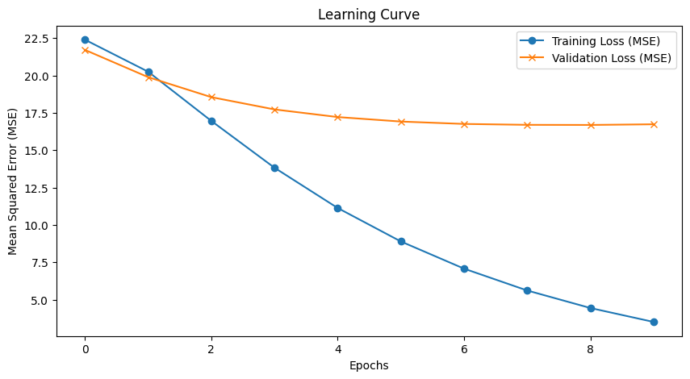
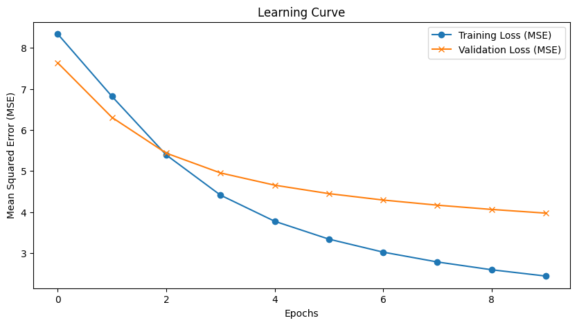
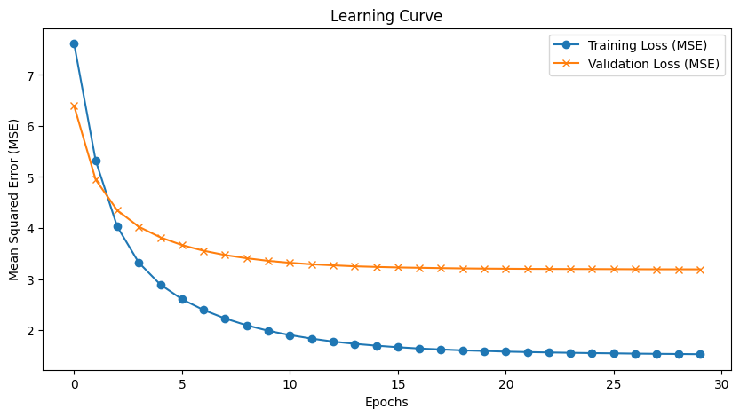
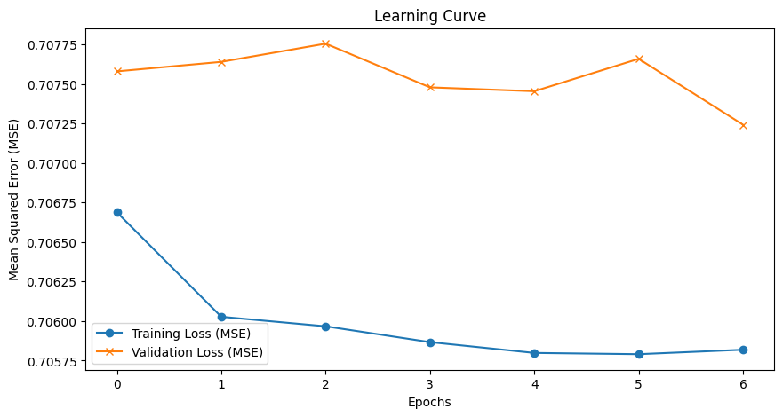

## Model Tuning & Experimentation Log

The following log details the iterative process used to optimize the Matrix Factorization model. The primary challenge was balancing model complexity (overfitting) with signal noise (implicit ratings).

| Exp # | Modification / Hypothesis | Training Loss | Validation Loss | Observation |
| :--- | :--- | :--- | :--- | :--- |
| **1** | **Baseline Model:** Initial run without regularization. | 3.5063 | 16.7113 | **High Variance:** Model memorized training data; failed to generalize. |
| **2** | **L2 Regularization:** Added weight decay (`1e-5`). | 7.4860 | 16.0763 | **Underfitting:** Regularization reduced overfitting but the model struggled to learn patterns (high bias). |
| **3** | **Architecture Update:** Added Xavier Initialization & Sigmoid output. | 2.1469 | 13.0396 | **Convergence Improved:** Sigmoid helped initialization, but severe overfitting returned. |
| **4** | **Constraint Testing:** Reduced embedding dim (25) & increased weight decay (`1e-3`). | 8.2617 | 11.8986 | **Stability:** Overfitting eliminated, but validation loss remained unacceptably high due to data noise. |
| **5** | **Data Cleaning (Breakthrough):** Removed implicit feedback (0 ratings). | 2.4441 | 3.9760 | **Significant Improvement:** Filtering out ambiguity allowed the model to learn true user preference. |
| **6** | **Hyperparameter Tuning:** Increased embedding dim (40) & adjusted weight decay (`1e-4`), added a dropout layer of 20%. | 1.6673 | 3.4310 | **Refinement:** The model began to capture more latent factors without overfitting. |
| **7** | **Extended Training:** Increased epochs to 30; reduced batch size to 256. | 1.5394 | 3.1984 | **Convergence:** Squeezed remaining performance out of the architecture. |
| **8** | **Final Model:** Increased embedding dim to 50. | **1.5275** | **3.1901** | **Optimal State:** Achieved lowest error with stable generalization. |

## Visual Analysis

### 1. The Baseline (High Variance)
*Observation: Notice the massive gap between Training and Validation loss.*

### 2. The Breakthrough (Data Cleaning)
*Observation: After removing implicit '0' ratings, the validation loss finally tracks with training loss.*

### 3. Final Convergence
*Observation: While a generalization gap remains (Train 1.5 vs Val 3.2), the Validation Loss stabilized and reached a robust minimum of 3.19. This indicates the model has successfully learned the latent factors without entering the regime of destructive overfitting.*

The following log details the iterative process used to optimize the Matrix Factorization model. The primary challenge was scaling the architecture from a data subset (1M rows) to the full dataset (25M rows) while managing model capacity to prevent underfitting.

| Exp # | Modification / Hypothesis | Training Loss (MSE) | Validation Loss (MSE) | Observation |
| :--- | :--- | :--- | :--- | :--- |
| **1** | **Baseline (1M Subset):** Initial run on data subset with default regularization (Dropout 0.2, Decay 1e-4) and Dim 50. | 0.6920 | 0.7188 | **Proof of Concept:** Validated pipeline stability. Good performance on the subset, establishing a baseline target for the full training run. |
| **2** | **Scale Up (25M Rows):** Applied baseline config (Dim 50) directly to the full dataset. | 0.8682 | 0.8681 | **Underfitting (Saturation):** Loss plateaued significantly higher than Exp 1. The near-identical Train/Val scores indicated the model wasn't overfitting, but simply lacked the capacity (Dim 50) to capture 25M patterns. |
| **3** | **Capacity Boost:** Increased Embedding Dim to 128, reduced Dropout (0.05) & Decay (1e-5). | **0.7058** | **0.7072** | **Optimal State:** Reducing regularization constraints and increasing "brain size" allowed the model to break the 0.86 floor. Achieved industry-standard error rates (~0.70) with stable generalization. |

## Visual Analysis

### 1. The Saturation Point (Experiment 2)
*Observation: Upon scaling to 25M rows without increasing model size, the loss flatlined at ~0.868. The perfect overlap between Training and Validation loss confirmed the model was underfitting (high bias).*

### 2. The Capacity Breakthrough (Experiment 3)
*Observation: By increasing the embedding dimension to 128 and relaxing regularization, the model successfully learned complex latent factors, dropping the loss to ~0.707 without diverging.*
